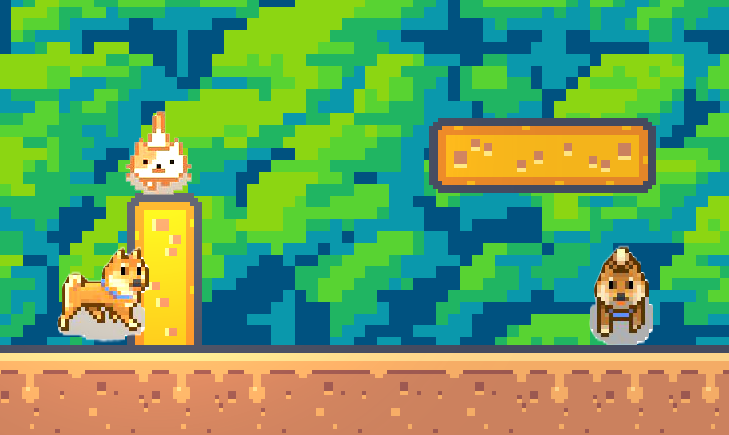

# pretty_cat

## Описание игры
Добро пожаловать в мой маленький 2D платформер, где главным героем является милый рыжий котик! Ваша цель - проходить различные паркур уровни, избегая опасных собак породы сиба-ину, и исследовать мир, полный удивительных приключений.

## Особенности игры
- **Паркур за котика**: Управляйте рыжим котиком, выполняйте захватывающие прыжки и маневры, чтобы преодолевать препятствия.
- **Лобби**: Исследуйте лобби, находите пасхалки и открывайте новые уровни.
- **Магазин**: Собирайте монетки и обменивайте их на помело и шоколадки.
- **Разнообразные уровни**: Играйте на уровнях разной сложности и избегайте агрессивных собак сиба-ину.
- **Собаки-сиба-ину**: Осторожно! Эти собаки могут укусить котика, нанося ему 30 урона.
- **Жизни котика**: У котика 9 жизней, каждая из которых состоит из 100 HP. Если все жизни закончатся, котик умрет.
- **Лабиринты**: Решайте два увлекательных лабиринта: большой и маленький.
- **Сохранения**: Игра поддерживает сохранение прогресса, чтобы вы могли продолжить свои приключения в любой момент.

## Начало игры
1. **Установка и запуск**:
- Запустите игру, чтобы увидеть главное меню.
2. **Навигация в меню**:
- Выберите "Новая игра" для начала нового приключения или "Продолжить" для загрузки сохраненного прогресса.
- В лобби вы можете найти скрытые пасхалки и доступ к новым уровням.
3. **Магазин**:
- Используйте собранные монетки для покупки предметов в магазине.
- В магазине можно обменивать монетки на помело и шоколадки, которые помогут в прохождении уровней.

## Управление
- **Перемещение**: Стрелки или клавиши WASD для перемещения.
- **Прыжок**: Пробел для прыжка.
- **Интеракция**: E для взаимодействия с объектами.

## Советы по игре
- Старайтесь избегать укусов собак-сиба-ину, так как каждый укус наносит 30 урона.
- Собирайте монетки на уровнях, чтобы купить полезные предметы в магазине.
- Исследуйте лобби и уровни на наличие пасхалок.
- Внимательно проходите лабиринты, они могут быть сложными, но награды за их прохождение того стоят.

Приятной игры!
